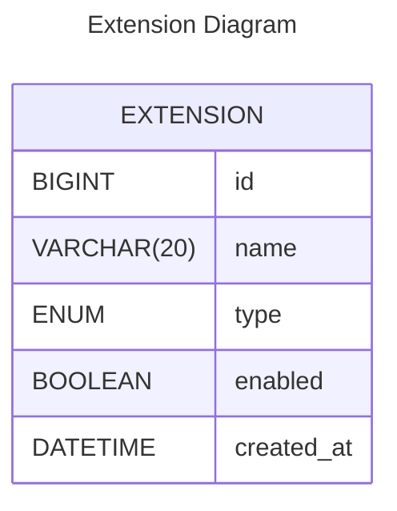

# “파일 확장자 차단” 과제

> [!CAUTION]
> 현재 과제 테스트가 종료되어, 배포한 클라우드 서비스를 모두 중단하였습니다. (EC2 Instance, RDS, Route53)

> [사이트 바로가기](https://madrascheck-extension-kmj.shop/extensions) 
> [SWAGGER 바로가기](https://madrascheck-extension-kmj.shop/swagger-ui/index.html)

https://github.com/user-attachments/assets/c8ccc1a8-2934-48de-b283-16acfeb9e439

## 기능
1. 고정 확장자 목록 관리
    - 차단 대상이 되는 “자주 차단하는 확장자” 목록을 화면에 보여준다.
    - 초기 상태(default)는 모두 **unchecked** 상태여야 한다
    - 사용자가 체크/언체크할 때마다 그 상태를 데이터베이스에 저장하고, 새로고침 시에도 동일하게 유지되어야 한다.
2. 커스텀 확장자 추가
    - 입력 폼에 확장자를 최대 **20자**까지 입력할 수 있다.
    - “추가” 버튼 클릭 시 입력값을 DB에 저장하고, 저장된 확장자를 목록 영역에 즉시 렌더링 한다.
    - 커스텀 확장자는 최대 **200개**까지 추가 가능하다.
3. 커스텀 확장자 삭제
    - 목록에 표시된 확장자 옆의 “X” 버튼 클릭으로 DB에서 삭제하고, UI에서도 즉시 제거한다.
4. **화면 호출**
    - 위 기능을 모두 테스트할 수 있는 웹 페이지(프론트엔드)가 동작해야 하며, 화면이 정상적으로 로드되는 수준까지 구현되어야 한다.

## 데이터베이스 ERD 설계

| 컬럼 | 타입 | 제약조건 | 설명 |
| --- | --- | --- | --- |
| `id` | BIGINT AUTO_INCREMENT | PRIMARY KEY | 고유 식별자 |
| `name` | VARCHAR(20) | NOT NULL | 확장자 문자열 (최대 20자) |
| `type` | ENUM('FIXED','CUSTOM') | NOT NULL | 고정 목록 / 커스텀 확장자 구분 |
| `enabled` | BOOLEAN | NOT NULL DEFAULT FALSE | FIXED 타입일 때만 차단 여부 사용 |
| `created_at` | DATETIME | NOT NULL DEFAULT CURRENT_TIMESTAMP | 레코드 생성 시각 |

## API 설계
> [!IMPORTANT]
> [SWAGGER 바로가기](https://madrascheck-extension-kmj.shop/swagger-ui/index.html)

- **GET /extensions**: 모든 확장자(FIXED + CUSTOM)와 `enabled` 값을 반환
- **PATCH /extensions/{id}**: FIXED 확장자의 `enabled` 토글
    - path: `id`
    - body: `{ enabled: boolean }`
    - 성공 시: 200 OK (FIXED 확장자 토글)
- **POST /extensions**: CUSTOM 확장자 추가
    - body: `{ name: string }`
    - 성공 시 201 Created, 생성된 객체 반환
- **DELETE /extensions/{id}**: CUSTOM 확장자 삭제
    - path: `id`
    - CUSTOM 확장자 삭제 (204 No Content)

## 구현내용
### 요구사항
- [x]  고정 확장자 목록 관리
    - 차단 대상이 되는 “자주 차단하는 확장자” 목록을 화면에 보여준다.
    - 초기 상태(default)는 모두 **unchecked** 상태여야 한다
    - 사용자가 체크/언체크할 때마다 그 상태를 데이터베이스에 저장하고, 새로고침 시에도 동일하게 유지되어야 한다.
- [x]  커스텀 확장자 추가
    - 입력 폼에 확장자를 최대 **20자**까지 입력할 수 있다.
    - “추가” 버튼 클릭 시 입력값을 DB에 저장하고, 저장된 확장자를 목록 영역에 즉시 렌더링 한다.
    - 커스텀 확장자는 최대 **200개**까지 추가 가능하다.
- [x]  커스텀 확장자 삭제
    - 목록에 표시된 확장자 옆의 “X” 버튼 클릭으로 DB에서 삭제하고, UI에서도 즉시 제거한다.
- [x]  **화면 호출**
    - 위 기능을 모두 테스트할 수 있는 웹 페이지(프론트엔드)가 동작해야 하며, 화면이 정상적으로 로드되는 수준까지 구현되어야 한다.

### 추가 구현 사항
- [x]  **중복 방지**
    - FIXED 목록에 이미 있는 확장자는 커스텀으로 추가 불가
    - 이미 추가된 커스텀 확장자는 다시 추가하지 못하도록 검사
- [x]  **입력값 정규화**
    - 앞뒤 공백 제거(trim)
